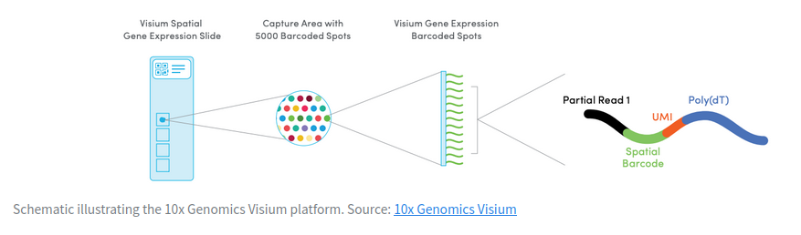

We load the libraries needed
```{r}
library(STexampleData)
library(SpatialExperiment)
```
There are a lot of different aproaches to obtaining spatial transcriptomic data. In this pipeline we are going to use 10X_genomics aproach. The tissue is a slide that has thousands of spots, each one containing a oligonucleotide with a barcode exclusive for each spot, an UMI, and a poly(dT) that will bind to the poly(A) tail of mRNAs on the tissue.
<br>

<br>
We load the raw data corresponding to a human dorsolateral prefrontal cortex

```{r}
#raw <- Visium_humanDLPFC()
```
Vemos que hay 33538 filas correspondientes a los genes y 4992 columnas corresponidendo a cada uno de los spots del tejido.
```{r}
raw
```

